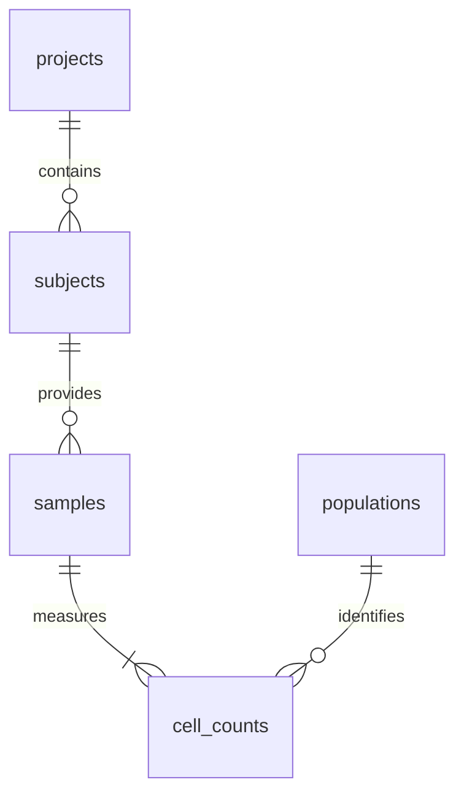

# Immune cell analysis

SQLite data pipeline and interactive dashboard for Loblaw Bio’s cell-count dataset.

**[Open the dashboard](https://GodisinHisHeaven.github.io/teiko/)** · **[Open in GitHub Codespaces](https://codespaces.new/GodisinHisHeaven/teiko)**

## Run in Codespaces

Open the repository in Codespaces. The included dev container uses Python 3.12 and runs setup and the pipeline automatically. Start the dashboard with:

```bash
make dashboard
```

Open port **8050** from Codespaces’ **Ports** tab. The forwarded address belongs to your Codespace. On your own computer, open [http://localhost:8050](http://localhost:8050).

To run everything manually in a fresh environment:

```bash
make setup
make pipeline
make dashboard
```

Python 3.11+ and `make` are required. Dependencies are installed in `.venv`; no database service, credentials, manual downloads, or environment variables are needed. The supplied `cell-count.csv` is included. Stop the dashboard with Ctrl+C. To change the port, use `make dashboard PORT=8051`.

The required targets are:

| Target | Action |
| --- | --- |
| `make setup` | Create `.venv` and install `requirements.txt`. |
| `make pipeline` | Run `load_data.py`, `analysis.py`, then `build_site.py` sequentially. |
| `make dashboard` | Serve the interactive dashboard on `0.0.0.0:8050`, reading the pipeline’s SQLite database. |
| `make test` | Run the data, statistical, loader and HTTP regression tests. |

The loader also runs directly, without arguments or third-party dependencies:

```bash
python load_data.py
```

It creates **`cell_counts.db` in the repository root**, regardless of the current working directory. Running it again rebuilds the database without duplicating rows. An invalid input leaves an existing database intact.

## Results for the supplied file

The dataset contains **10,500 samples**, **3,500 subjects**, **3 projects**, and **52,500 sample/population observations**. Each subject has samples at days 0, 7 and 14. The file uses `condition` and `sex` for the assignment’s indication and gender fields, and `sample` for the sample identifier. The schema preserves those source names.

### Part 2: relative frequencies

For each sample:

```text
total_count = b_cell + cd8_t_cell + cd4_t_cell + nk_cell + monocyte
percentage = 100 × count / total_count
```

The SQLite view `sample_frequencies` and `reports/sample_frequencies.csv` contain exactly:

```text
sample,total_count,population,count,percentage
```

Calculations retain full precision. The dashboard rounds percentages for display. The denominator is the five measured populations, not an independently measured total leukocyte count. Zero-total samples remain in the table with NULL percentages, which are excluded from inference and reported in the analysis metadata. None occur in the supplied file.

### Part 3: response comparison

The comparison includes only **melanoma**, **miraclib**, **PBMC**, and known `yes`/`no` response. It contains **1,968 samples from 656 subjects**: **331 responders** and **325 non-responders**.

The primary analysis averages each subject’s sample percentages across their visits, then compares these independent subject averages. This prevents three visits from being counted as three independent patients. Subjects receive equal weight. The dashboard can also show the individual-sample boxplots requested in the assignment, and provides a separate baseline-only sensitivity analysis.

| Population | Responders, mean % | Non-responders, mean % | Difference, percentage points | Raw p | Holm-adjusted p |
| --- | ---: | ---: | ---: | ---: | ---: |
| B cells | 9.80 | 10.00 | -0.199 | 0.3458 | 0.7935 |
| CD8 T cells | 24.88 | 24.94 | -0.062 | 0.6221 | 0.7935 |
| CD4 T cells | 30.54 | 29.90 | +0.636 | 0.0124 | 0.0621 |
| NK cells | 14.84 | 15.07 | -0.232 | 0.1267 | 0.5070 |
| Monocytes | 19.94 | 20.08 | -0.143 | 0.2645 | 0.7935 |

**No population meets the Holm-adjusted 0.05 significance threshold.** CD4 T cells have a nominal association before correction, but this does not survive the five-test correction. No population meets the corrected threshold at baseline either. Lack of significance does not establish equivalence.

Statistical choices:

- Two-sided **Mann–Whitney U** tests compare the distributions of subject averages, using the asymptotic method with tie and continuity corrections. Normality is not assumed. This is not specifically a test of equal means or medians.
- **Holm correction** controls familywise error across five populations at 0.05. This method remains valid under dependence, which matters because the five percentages sum to 100%.
- Exports include group sizes, means, medians, U statistics, raw/adjusted p-values, **Cliff’s delta** (`2U / (n_yes × n_no) - 1`), and mean differences. Positive differences/delta indicate higher values among responders.
- The **95% percentile bootstrap intervals** describe mean differences in percentage points, with 2,000 within-group subject resamples and a fixed seed of 20261007 (plus population index). These intervals are not adjusted for multiple testing and need not agree with the adjusted rank-test decision.
- The primary and baseline analyses each use their own five-test family. Baseline results are a secondary sensitivity analysis, not a second opportunity to select a favorable p-value.
- A population requires at least two subjects in each response group to be tested. Untestable populations retain their place in the five-test correction and are reported as unavailable.

These are exploratory associations. The all-visits analysis includes post-treatment measurements, so it cannot establish a pretreatment predictor. Baseline features would need a separate model and subject-level held-out validation before predictive use. The comparisons do not adjust for project, age or sex, and relative frequencies can change when another population changes. They do not establish a causal drug effect.

References: [SciPy Mann–Whitney U documentation](https://docs.scipy.org/doc/scipy/reference/generated/scipy.stats.mannwhitneyu.html) and [Holm, *A Simple Sequentially Rejective Multiple Test Procedure* (1979)](https://www.jstor.org/stable/4615733).

### Part 4: baseline subset

The required subset is `condition = 'melanoma'`, `treatment = 'miraclib'`, `sample_type = 'PBMC'`, and `time_from_treatment_start = 0`.

| Measure | Result |
| --- | ---: |
| Samples | 656 |
| Distinct subjects | 656 |
| prj1 samples | 384 |
| prj2 samples | 0 |
| prj3 samples | 272 |
| Responding subjects | 331 |
| Non-responding subjects | 325 |
| Male subjects | 344 |
| Female subjects | 312 |

Project summaries count samples. Response and sex summaries use **`COUNT(DISTINCT subject)`**, even if multiple baseline samples exist for one subject. No unknown responses occur in this subset. Blank source responses elsewhere are preserved as SQL NULL, not mapped to non-response.

**The average B-cell count for male melanoma responders at time 0, across all treatments and sample types, is `10206.15`.** This is the sample-weighted arithmetic mean over **485 samples from 485 subjects**. It includes both miraclib and phauximab, and both PBMC and WB. The query deliberately does not reuse the narrower Part 4 cohort:

```sql
SELECT AVG(c.count)
FROM sample_metadata AS m
JOIN cell_counts AS c USING (sample)
WHERE m.condition = 'melanoma'
  AND m.sex = 'M'
  AND m.response = 'yes'
  AND m.time_from_treatment_start = 0
  AND c.population = 'b_cell';
```

## Database design



| Table | Key and contents |
| --- | --- |
| `projects` | Primary key `project`. |
| `subjects` | Primary key `subject`; project foreign key; condition, age, sex, treatment and response. |
| `samples` | Primary key `sample`; subject foreign key; sample type and time from treatment start. |
| `populations` | Primary key `population`; display order for the five cell populations. |
| `cell_counts` | Composite primary key `(sample, population)`; integer, nonnegative count; two foreign keys. |
| `load_metadata` | Source filename, SHA-256 checksum, source row count and schema version. |

The long-form counts table avoids adding a new measurement column to the database for each population. `sample_metadata`, `sample_totals`, `sample_frequencies`, and `baseline_miraclib_melanoma_pbmc` are views that centralize the joins and analytical definitions. Indexes support cohort filters, subject joins and sample type/time filters. The baseline and additional B-cell summaries run as SQL queries.

In this dataset, subject IDs are globally unique and each subject has one project, condition, age, sex, treatment and response. The loader checks that these attributes agree across all of a subject’s samples. It rejects conflicting metadata rather than choosing an arbitrary row. For a future multi-regimen study or project-local subject IDs, enrollment/treatment episodes and composite subject keys would need to be modeled explicitly.

The importer validates required fields, identifiers, allowed response/sex values, integer counts, SQLite integer bounds, duplicate samples and subject consistency before publishing the database. It inserts all five counts per sample, enforces foreign keys, runs SQLite integrity checks, closes the new database, and atomically replaces the previous one. No source rows are silently dropped. Healthy samples with blank responses are retained.

## Dashboard and generated files

The dashboard contains:

- **Sample overview:** project, condition, treatment and sample-type filters; sample/subject search; a sample composition chart; the required five-column frequency table with pagination and downloads.
- **Treatment response:** boxplots for all five populations; all-visits and baseline windows; subject-average and individual-sample views; adjusted tests, effect estimates and intervals.
- **Baseline cohort:** project sample counts, distinct subject counts by response and sex, all matching samples, the broader B-cell average, and the SQL used.

Plotly charts support hover, zoom and SVG export. The JavaScript library is served locally, so the dashboard does not need a chart CDN.

The local Flask server opens **SQLite in read-only mode**. `data.json` and CSV downloads are calculated from that database, and its cached analysis refreshes when the database is replaced. The public GitHub Pages dashboard uses the same interface with a static JSON/CSV export created from SQLite by the pipeline. It updates when the GitHub Actions workflow on `main` succeeds; it does not run a Python server on Pages.

Generated files are excluded from Git and can be reproduced with `make pipeline`:

| Output | Contents |
| --- | --- |
| `cell_counts.db` | Root SQLite database. |
| `reports/sample_frequencies.csv` | All 52,500 sample/population rows. |
| `reports/response_cohort.csv` | Eligible Part 3 samples in long form, with metadata. |
| `reports/subject_frequencies.csv` | Subject means used in the primary inference. |
| `reports/response_statistics.csv` | Primary tests, effect sizes and bootstrap intervals. |
| `reports/baseline_statistics.csv` | Baseline-only sensitivity analysis. |
| `reports/baseline_samples.csv` | All eligible Part 4 samples. |
| `reports/baseline_by_*.csv` | Project, response and sex summaries. |
| `reports/summary.json` | Main results and input fingerprint. |
| `reports/analysis.json` | Complete dashboard data. |
| `site/` | Static dashboard with local assets and downloadable reports. |

## Verification

```bash
make test
```

Tests check every source metadata field and cell count against SQLite; frequency totals; exact cohort filters and counts; the broader B-cell calculation; distinct-subject counting; repeated-visit aggregation; Holm adjustment; deterministic inference; zero counts and missing responses; malformed-input handling; safe reloads; direct loader execution; and dashboard responses/exports. GitHub Actions runs setup, the complete pipeline and tests on Linux before deploying the dashboard.

Source: [cell-count.csv on Google Drive](https://drive.google.com/file/d/1eMfLCQBIqChy8FVej5yE-9h9UL7oTvVy/view). The committed file has SHA-256 `011373475d37417d4131d4a06efeb58df89c4adc76451a5efa48a535ed293c82`.
